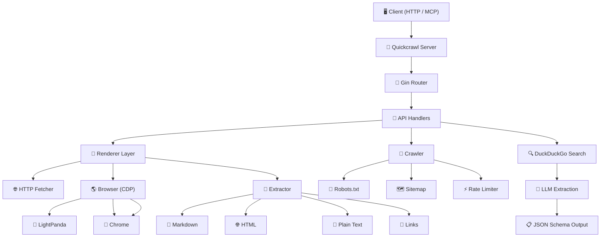

# Quickcrawl

<div align="center">

# **Quickcrawl**

### 🚀 Web Scraping API for AI Agents — Scrape, crawl, and map websites with a single binary.

**Playground:** [Try it online](https://quickcrawl-production-814a.up.railway.app/playground)

[](https://go.dev/)
[](https://gin-gonic.com/)
[](https://modelcontextprotocol.io/)
[](https://www.google.com/chrome/)
[](https://www.google.com/chrome/)
[](https://github.com/nicholasjackson/lightpanda)
[](https://duckduckgo.com/)

[](https://railway.com/deploy/9gVVr1?referralCode=jEIluR&utm_medium=integration&utm_source=template&utm_campaign=generic)

</div>

---

## ⚡ Overview

Quickcrawl is a powerful Go-based web scraping service that brings intelligence to AI agents. Whether you're scraping a single page, crawling an entire website, or mapping out link structures — Quickcrawl handles the heavy lifting with a sophisticated multi-layered architecture combining HTTP fetching, browser automation, and LLM-powered structured extraction.

---

## ✨ Features

| Feature | Description |
|---------|-------------|
| 🌐 **Web Scraping** | Convert any URL to Markdown, HTML, Plain Text, or Links |
| 🔄 **Async Crawling** | BFS website crawler with depth/page limits and rate limiting |
| 🗺️ **URL Mapping** | Discover all URLs on a site instantly without scraping content |
| 🧠 **JavaScript Rendering** | Auto-detect SPAs and render via LightPanda or Chrome |
| 📊 **LLM Extraction** | Send a JSON schema, get validated structured data back |
| 🔍 **Web Search** | DuckDuckGo-powered search for AI agent integration |
| 🤖 **MCP Server** | Built-in stdio transport for seamless AI agent integration |
| 📦 **Multi-format Output** | Markdown, HTML, RawHTML, PlainText, Links, JSON |

---

## 📊 Benchmark

> **85.4%** scrape success rate across 1,000 diverse URLs from the [Firecrawl Scrape Content Dataset v1](https://huggingface.co/datasets/firecrawl/scrape-content-dataset-v1)

Tested against Firecrawl v2.5 on the same dataset:

| Feature | Quickcrawl | Firecrawl |
|---------|------------|-----------|
| Coverage | 85.4% | 79.4% |
| Avg Scrape Latency | **1,841.9ms** | 4,048ms |
| Self-hosting | Single binary | Multi-container (~4GB+) |
| Cost / 1K scrapes | **$0** (self-hosted) | $9 |


### Quality Metrics

| Metric | Value |
|--------|-------|
| Content Recall | 44.03% |
| Noise Rejection | 86.65% |
| Content Matches | 376 |
| Noise Leaks | 114 |


### Use Cases

Build RAG pipelines with clean LLM-ready markdown, give AI agents real-time web access, monitor content changes, extract structured data, convert HTML to clean markdown, or archive web pages at scale.

---

## 🤖 MCP Server

Quickcrawl MCP server provides AI agents with web scraping capabilities:

### Available Tools

| Tool | Description |
|------|-------------|
| `quickcrawl_scrape` | Scrape a single URL |
| `quickcrawl_crawl` | Start async website crawl |
| `quickcrawl_check_crawl_status` | Check crawl job status |
| `quickcrawl_cancel_crawl` | Cancel running crawl |
| `quickcrawl_map` | Discover URLs on a site |
| `quickcrawl_search` | Search DuckDuckGo |

### OpenCode Integration

Add Quickcrawl to your OpenCode configuration:

```json
{
  "mcp": {
    "quickcrawl": {
      "type": "local",
      "command": ["npx", "-y", "@mabudalam/quickcrawl-mcp"],
      "enabled": true
    }
  }
}
```

### Configuration

Renderer selection in MCP:
- Omit `renderer` or set `renderer: "auto"` to use the configured fallback chain
- Set `renderer: "lightpanda"` or `"chrome"` to hard-pin a single renderer
- Pinned renderers imply `renderJs: true` unless `renderJs: false` is set explicitly

Example MCP tool arguments:

```json
{
  "url": "https://www.notion.so/",
  "formats": ["markdown"],
  "renderJs": true,
  "renderer": "chrome",
  "onlyMainContent": true
}
```

---

## 🏗️ Architecture



### Renderer Fallback Chain

```
Request
    ↓
HTTP Fetcher (plain HTML, fastest)
    ↓ (if SPA detected or JS requested)
LightPanda (headless browser, fast)
    ↓ (if LightPanda unavailable)
Chrome DevTools (full browser, most compatible)
```

---

## 🔌 API Endpoints

### 🌐 Scraping — `/v1/scrape`

| Method | Path | Description |
|--------|------|-------------|
| `POST` | `/v1/scrape` | Scrape a single URL with multiple output formats |

**Request:**

```json
{
  "url": "https://www.mabud.dev/",
  "formats": ["markdown"],
  "onlyMainContent": true,
  "renderJs": false,
  "topK": 5
}
```

**Response:**

```json
{
  "success": true,
  "data": {
    "markdown": "# Hey, I'm Mabud.\n\nI build AI native systems...",
    "metadata": {
      "title": "Mabud Alam",
      "description": "Software Engineer",
      "ogpTitle": "Mabud Alam",
      "ogpDescription": "Software Engineer",
      "sourceURL": "https://www.mabud.dev/",
      "language": "en",
      "statusCode": 200,
      "renderedMode": "http",
      "timeTaken": 866
    }
  }
}
```

### 🔄 Crawling — `/v1/crawl`

| Method | Path | Description |
|--------|------|-------------|
| `POST` | `/v1/crawl` | Start an async BFS crawl of a website |
| `GET` | `/v1/crawl/:id` | Check crawl status and retrieve results |
| `DELETE` | `/v1/crawl/:id` | Cancel a running crawl job |

**Start Crawl Request:**

```json
{
  "url": "https://www.mabud.dev/",
  "maxDepth": 2,
  "maxPages": 100,
  "formats": ["markdown"],
  "onlyMainContent": true,
  "renderJs": false
}
```

**Check Status Request:** `GET /v1/crawl/:id`

No body required.

**Cancel Request:** `DELETE /v1/crawl/:id`

No body required.

### 🗺️ Mapping — `/v1/map`

| Method | Path | Description |
|--------|------|-------------|
| `POST` | `/v1/map` | Discover all URLs on a site instantly |

**Request:**

```json
{
  "url": "https://www.mabud.dev/",
  "maxDepth": 2,
  "useSitemap": true,
  "timeout": 30000
}
```

**Response:**

```json
{
  "success": true,
  "data": {
    "links": [
      "https://www.mabud.dev/blog",
      "https://www.mabud.dev/projects",
      "https://www.mabud.dev/resume"
    ]
  }
}
```

### 🔍 Search — `/v1/search`

| Method | Path | Description |
|--------|------|-------------|
| `POST` | `/v1/search` | Search DuckDuckGo and scrape results in parallel |

### 🏥 Health — `/health`

| Method | Path | Description |
|--------|------|-------------|
| `GET` | `/health` | Health check with browser availability and active job count |

---

## 🧠 LLM Extraction

Quickcrawl supports JSON Schema-based extraction for structured data:

```json
{
  "url": "https://news.example.com",
  "formats": ["markdown", "json"],
  "onlyMainContent": true,
  "extract": {
    "schema": {
      "type": "object",
      "properties": {
        "title": { "type": "string" },
        "author": { "type": "string" },
        "publishDate": { "type": "string" }
      },
      "required": ["title", "author"]
    },
    "prompt": "Extract article title, author, and publish date",
    "responseFormat": "article"
  },
  "chunkStrategy": { "type": "sentence" },
  "query": "article title and author",
  "filterMode": "bm25",
  "topK": 5
}
```

### Chunking Strategies

| Strategy | Description |
|----------|-------------|
| `sentence` | Split by sentence boundaries |
| `paragraph` | Split by paragraph boundaries |
| `regex` | Split by custom regex pattern |
| `topic` | Split by topic changes |

### Filter Modes

| Mode | Description |
|------|-------------|
| `bm25` | BM25 algorithm for relevance scoring |
| `rrf` | Reciprocal Rank Fusion |
| `hybrid` | Combine bm25 and rrf |

---

## ⚙️ Configuration

Config file: `quickcrawl.toml`

```toml
[server]
host = "0.0.0.0"
port = 3000
rate_limit_rps = 10

[renderer]
mode = "auto"           # auto, none, chrome, lightpanda
page_timeout_ms = 30000
pool_size = 4
render_js_default = false

[renderer.lightpanda]
ws_url = ""

[renderer.chrome]
ws_url = ""

[crawler]
max_concurrency = 40
requests_per_second = 40.0
respect_robots_txt = true
default_max_depth = 2
default_max_pages = 100

[extraction.llm]
provider = "openai"
model = "gpt-4o-mini"
api_key = ""
base_url = ""
max_tokens = 4000
temperature = 0.7
```

Or via environment variables:

```bash
SERVER__PORT=3000
RENDERER__MODE=auto
RENDERER__CHROME__WS_URL=ws://127.0.0.1:9222/devtools/browser/...
CRAWLER__MAX_CONCURRENCY=40
EXTRACTION__LLM__API_KEY=your-key
```

---

## 📂 Project Structure

```
quickcrawl/
├── cmd/
│   ├── server/              # HTTP API server
│   └── mcp/                 # MCP server for AI agents
├── internal/
│   ├── api/                 # HTTP handlers, routes, middleware
│   ├── crawler/             # BFS crawler, robots.txt, sitemap
│   ├── extractor/           # HTML cleaning, markdown, chunking
│   ├── renderer/            # HTTP, browser fetching via CDP
│   ├── search/              # DuckDuckGo integration
│   ├── mcp/                 # MCP tool implementation
│   └── types/               # Type definitions
├── playground/              # Web UI playground
├── npm/                     # NPM wrapper package
├── python/                  # Python client
├── bench/                   # Benchmarks
├── scripts/                 # Release scripts
└── workflows/               # CI/CD workflows
```

---

## 👨‍💻 Tech Stack

| Tech | Use Case |
|------|----------|
| **Go 1.21+** | Core backend language |
| **Gin** | HTTP framework |
| **goquery** | HTML parsing and DOM manipulation |
| **lightpanda** | Headless browser automation (CDP over WebSocket) |
| **Chrome DevTools** | Browser automation via CDP WebSocket |

| **MCP SDK** | Model Context Protocol server |
| **slog** | Structured logging |


## 🧪 Playground UI

Quickcrawl includes a web-based playground for testing:

```
playground/
├── app/
│   └── playground/
│       └── page.tsx        # Main playground UI
├── components/
│   └── response-viewer.tsx  # Response display components
└── lib/
    └── api-client.ts        # API client functions
```

Access at `http://localhost:3000/playground` when the server is running.

---

## 🚀 Deployment

### Docker

Docker images are published to GitHub Container Registry:

```bash
# Server
docker build -f infra/Dockerfile.server -t quickcrawl .
docker run -p 3000:3000 quickcrawl

# Playground
docker build -f infra/Dockerfile.playground -t quickcrawl-playground .
docker run -p 3000:3000 quickcrawl-playground
```

### Railway

[](https://railway.com/deploy/9gVVr1?referralCode=jEIluR&utm_medium=integration&utm_source=template&utm_campaign=generic)

1. Click the button above
2. Connect your GitHub repository
3. Configure environment variables
4. Deploy

---

