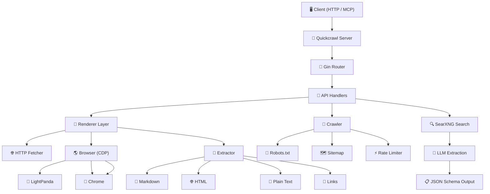

# Quickcrawl

<div align="center">


### 🚀 Web Scraping API for AI Agents — Scrape, crawl, and map websites with a single binary.

**Playground:** [Try it online](https://quickcrawl-production-814a.up.railway.app/playground)

[](https://go.dev/)
[](https://gin-gonic.com/)
[](https://modelcontextprotocol.io/)
[](https://www.google.com/chrome/)
[](https://www.google.com/chrome/)
[](https://github.com/nicholasjackson/lightpanda)
[](https://searxng.org/)

[](https://railway.com/deploy/9gVVr1?referralCode=jEIluR&utm_medium=integration&utm_source=template&utm_campaign=generic)

</div>

---

## ⚡ Overview

Quickcrawl is a powerful Go-based web scraping service that brings intelligence to AI agents. Whether you're scraping a single page, crawling an entire website, or mapping out link structures — Quickcrawl handles the heavy lifting with a sophisticated multi-layered architecture combining HTTP fetching, browser automation, and LLM-powered structured extraction.

---

## ✨ Features

| Feature | Description |
|---------|-------------|
| 🌐 **Web Scraping** | Convert any URL to Markdown, HTML, Plain Text, or Links |
| 🔄 **Async Crawling** | BFS website crawler with depth/page limits and rate limiting |
| 🗺️ **URL Mapping** | Discover all URLs on a site instantly without scraping content |
| 🧠 **JavaScript Rendering** | Auto-detect SPAs and render via LightPanda or Chrome |
| 📊 **LLM Extraction** | Send a JSON schema, get validated structured data back |
| 🔍 **Web Search** | SearXNG-powered search for AI agent integration |
| 🤖 **MCP Server** | Built-in stdio transport for seamless AI agent integration |
| 📦 **Multi-format Output** | Markdown, HTML, RawHTML, PlainText, Links, JSON |

---

## 📊 Benchmark

> **85.4%** scrape success rate across 1,000 diverse URLs from the [Firecrawl Scrape Content Dataset v1](https://huggingface.co/datasets/firecrawl/scrape-content-dataset-v1)

Tested against Firecrawl v2.5 on the same dataset:

| Feature | Quickcrawl | Firecrawl |
|---------|------------|-----------|
| Coverage | 85.4% | 79.4% |
| Avg Scrape Latency | **1,841.9ms** | 4,048ms |
| Self-hosting | Single binary | Multi-container (~4GB+) |
| Cost / 1K scrapes | **$0** (self-hosted) | $9 |


### Quality Metrics

| Metric | Value |
|--------|-------|
| Content Recall | 44.03% |
| Noise Rejection | 86.65% |
| Content Matches | 376 |
| Noise Leaks | 114 |


### Use Cases

Build RAG pipelines with clean LLM-ready markdown, give AI agents real-time web access, monitor content changes, extract structured data, convert HTML to clean markdown, or archive web pages at scale.

---

## 🤖 MCP Server

Quickcrawl MCP server provides AI agents with web scraping capabilities:

### Available Tools

| Tool | Description |
|------|-------------|
| `scrape` | Scrape a single URL |
| `crawl` | Start async website crawl |
| `check_crawl_status` | Check crawl job status |
| `cancel_crawl` | Cancel running crawl |
| `map` | Discover URLs on a site |
| `site_map` | Discover URLs without scraping content (sitemap-aware) |
| `search` | Search SearXNG |

### OpenCode Integration

Add Quickcrawl to your OpenCode configuration:

```json
{
  "mcp": {
    "quickcrawl": {
      "type": "local",
      "command": ["npx", "-y", "@mabudalam/quickcrawl-mcp"],
      "enabled": true
    }
  }
}
```

### Configuration

Renderer selection in MCP:
- Set `renderJs: true` to use the configured Chrome browser (chromedp) for the request
- Set `renderJs: false` (default) to use the plain HTTP fetcher
- When `[renderer.chrome].ws_url` is unset in `quickcrawl.toml`, MCP auto-launches a local LightPanda and uses its CDP endpoint. The launched process is killed on MCP shutdown.

Example MCP tool arguments:

```json
{
  "url": "https://www.notion.so/",
  "formats": ["markdown"],
  "renderJs": true
}
```

---

## 💻 CLI

The Quickcrawl CLI provides standalone command-line access to all features. No server or Python needed.

### Installation

```bash
# Quick install (recommended)
curl -fsSL https://raw.githubusercontent.com/MabudAlam/quickcrawl/main/install.sh | sh

# Or from source
go install github.com/MabudAlam/quickcrawl/cli

# Download from GitHub releases
curl -L https://github.com/MabudAlam/QuickCrawl/releases/latest/download/quickcrawl_darwin_arm64.tar.gz | tar -xz
./quickcrawl --help
```

### Usage

```bash
# Scrape a single URL
quickcrawl scrape https://example.com
quickcrawl scrape https://example.com --formats html,markdown

# Crawl a website
quickcrawl crawl https://example.com --max-pages 10 --max-depth 3

# Discover URLs (without scraping content)
quickcrawl map https://example.com --max-depth 2

# Search SearXNG
quickcrawl search "golang web scraping"
quickcrawl search "python" --scrape --formats markdown
```

### CLI Examples

See [`cli/cmd/`](cli/cmd/) for all subcommands:
- [`scrape.go`](cli/cmd/scrape.go) — Scrape single URLs
- [`crawl.go`](cli/cmd/crawl.go) — Crawl websites
- [`map.go`](cli/cmd/map.go) — Discover URLs
- [`search.go`](cli/cmd/search.go) — Web search

---

## 🐍 Python SDK

Python SDK for Quickcrawl — scrape, crawl, and map websites from Python code.

### Installation

```bash
# From PyPI (coming soon)
pip install quickcrawl

# From GitHub
pip install git+https://github.com/MabudAlam/quickcrawl.git@python-sdk#subdirectory=python

# Or clone and install
git clone https://github.com/MabudAlam/quickcrawl
cd quickcrawl/python
pip install -e .
```

### Quick Start

```python
from quickcrawl import QuickCrawlClient

# CLI mode (zero config, auto-downloads binary)
with QuickCrawlClient() as client:
    result = client.scrape("https://example.com")
    print(result["markdown"])

# HTTP mode (connect to deployed server)
client = QuickCrawlClient(api_url="https://your-server.com", api_key="...")
result = client.scrape("https://example.com")
```

### Python SDK Examples

See [`python/examples/`](python/examples/):
- [`01_scrape.py`](python/examples/01_scrape.py) — Scrape a single URL
- [`02_crawl.py`](python/examples/02_crawl.py) — Crawl entire website
- [`03_map.py`](python/examples/03_map.py) — Discover URLs without scraping
- [`04_formats.py`](python/examples/04_formats.py) — Multiple output formats
- [`05_cloud.py`](python/examples/05_cloud.py) — Connect to deployed server
- [`06_search.py`](python/examples/06_search.py) — Web search with scraping
- [`perplexity.py`](python/examples/perplexity.py) — Perplexity-style AI research agent with Google ADK

---

## 🏗️ Architecture



### Renderer Selection

```
Request
     ↓
*core.Scraper  (single render path; chromedp + shared HTTPFetcher)
     ↓
     ├── renderJs=false → renderer.HTTPFetcher  (plain HTTP GET, no JS)
     │
     └── renderJs=true  → chromedp RemoteAllocator → persistent Chrome
                          (JS rendered, anti-bot stealth, SPA readiness poll)
```

Both `cli` and `mcp` entry points auto-launch a local LightPanda when no
Chrome WS URL is configured (HTTP server does not — it requires a user-supplied
WS URL and falls back to HTTP-only when none is configured).

### Scrape API End-to-End Flow

When a client calls `POST /v1/scrape`, Quickcrawl executes the following pipeline:

```
HTTP POST /v1/scrape
    │
    ▼
handlers.Scrape()                       [internal/api/handlers/handler.go:64]
    │  • Parse + JSON-decode into core.ScrapeRequest
    │  • Validate URL (http/https required, non-empty)
    │  • Default formats to ["markdown"] if empty
    │  • Optional robots.txt check (config: crawler.respect_robots_txt)
    │
    ▼
core.Scraper.Scrape()                  [internal/core/scraper.go:69]
    │  • resolveRenderJS()   — request override, defaults to false
    │  • resolveWaitMs()     — request override, defaults to 0
    │  • resolveFormats()    — string→types.OutputFormat conversion
    │
    ▼
core.Renderer.FetchOrchestrator()      [internal/core/renderer.go:213]
    │
    ├── (renderJs=false) ── HTTP path ──────────────────┐
    │                                                    │
    │                                     renderer.HTTPFetcher.Fetch()
    │                                     [internal/renderer/http.go]
    │                                     • HTTP GET with stealth headers
    │                                     • Returns FetchResult{HTML, StatusCode}
    │
    └── (renderJs=true)  ── CDP path ───────────────────┐
                                                      ▼
core.Renderer.fetchWithCDPBrowser()   [internal/core/renderer.go:334]
    │  • Acquire per-host concurrency slot
    │  • Create isolated browser context (chromedp.NewContext)
    │  • Apply page_timeout_ms to chromedp.Run
    │  • Action sequence:
    │      - enableNetworkTracking(networkBundle)
    │      - stealthInjectionAction()           (when crawler.stealth.enabled)
    │      - navigateIgnoringHTTPStatus()
    │      - dismissCookieBannersFastAction()   (when waitMs == 0)
    │      - WaitForSPAReady()                  (polls for content readiness,
    │                                            network-idle, or selector hit)
    │      - autoScrollAction()                 (when waitMs == 0 + lazy markers)
    │      - OuterHTML of <head> + <body>
    │  • Anti-bot challenge detection (status 4xx/5xx)
    │  • Returns FetchResult{HTML, FinalURL, StatusCode, ContentType}
    │
    ▼
core.Extractor.Extract()               [internal/core/extractor.go]
    │  • ExtractMetadata — title, description, OG tags, canonical, language
    │  • preprocessHTML  — strip head, cleanNoise, applyNoisePatterns
    │                       (and IncludeTags / ExcludeTags / CSSSelector if set)
    │  • postprocessHTML — sanitize, dedupe, normalize whitespace
    │  • HTMLToMarkdown  — primary conversion (fullClean → structural → plaintext)
    │  • HTMLToPlaintext
    │  • ExtractLinks, ExtractImageURLs
    │
    ▼ Returns: core.ScrapeData{Markdown, HTML, PlainText, Links, ImageLinks, Metadata}
    │
    ▼
(Optional) LLM Structured Extraction   [internal/core/llm.go]
    │  • Triggered when formats contains "json" and [extraction.llm] is configured
    │  • buildLLMInput → callOpenAI(chat/completions) → validateDataAgainstSchema
    │  • Populates data.JSON
    │
    ▼
handlers.Scrape()
    │  • If statusCode >= 400 and body < 200 chars → surface as failure
    │  • Else return success with data + warning
    │
    ▼
c.JSON(http.StatusOK, APIResponse{ScrapeData})
```

### Crawl API End-to-End Flow

```
HTTP POST /v1/crawl
    │
    ▼
handlers.StartCrawl()                  [internal/api/handlers/handler.go:166]
    │  • Parse + JSON-decode into types.CrawlRequest
    │  • Validate URL, maxDepth (0-10), maxPages (1-1000)
    │  • Default maxDepth/maxPages from config
    │  • Reject formats=["json"] with 400 (use /v1/scrape for LLM extraction)
    │  • Generate job ID, store in AppState.CrawlJobs
    │
    ▼
crawler.RunCrawl()                     [internal/crawler/crawl.go]
    │  • BFS from seed URL, respecting same-origin
    │  • robots.txt check per page (if enabled)
    │  • Per-host rate limiter (crawler.requests_per_second)
    │  • Per-host + global concurrency slots
    │  • For each page:
    │      - core.Scraper.Scrape() (same pipeline as above)
    │      - Stealth jitter added to inter-request sleep
    │      - Update CrawlState via stateCh
    │
    ▼ Returns: types.CrawlState{Total, Completed, Data[], Status}
    │
    ▼
c.JSON(http.StatusOK, CrawlStartResponse{ID})

GET /v1/crawl/:id  →  handlers.GetCrawlStatus()  →  returns CrawlState
DELETE /v1/crawl/:id → handlers.CancelCrawl()     →  204 No Content
```

---

## 🔌 API Endpoints

### 🌐 Scraping — `/v1/scrape`

| Method | Path | Description |
|--------|------|-------------|
| `POST` | `/v1/scrape` | Scrape a single URL with one or more output formats |

Scrape a single URL. This is the canonical endpoint for fetching and
extracting content from one page — supports HTTP, browser (JS) rendering,
content filters, and LLM-based structured extraction.

**Request body** (`core.ScrapeRequest`):

| Field | Type | Required | Description |
|-------|------|----------|-------------|
| `url` | string | yes | Absolute `http://` or `https://` URL to scrape |
| `formats` | string[] | no | Output formats. One or more of `markdown`, `html`, `rawHtml`, `plainText`, `links`, `imageLinks`, `json`. Defaults to `["markdown"]` |
| `renderJs` | bool | no | When `true`, fetch the page through a headless Chrome (chromedp). When `false` (default), use plain HTTP via the shared `*renderer.HTTPFetcher` |
| `waitFor` | int | no | Milliseconds to wait after navigation for late content / XHRs. `0` = use the SPA-readiness poll (default) |
| `headers` | object | no | Custom HTTP headers sent on the fetch |
| `includeTags` | string[] | no | CSS selectors to keep (e.g. `["article", "h1"]`) — applied during `preprocessHTML` |
| `excludeTags` | string[] | no | CSS selectors to drop (e.g. `["nav", "footer", ".ad"]`) |
| `cssSelector` | string | no | Extract content matching this CSS selector only |
| `jsonSchema` | object | no | JSON Schema used by `formats:["json"]` to constrain LLM extraction |
| `extract` | object | no | LLM extraction overrides: `{ schema, prompt, responseFormat }` |
| `llmExtractionPrompt` | string | no | Per-request LLM system prompt override |
| `llmResponseFormat` | string | no | Per-request LLM `response_format` name override |
| `browser` | string | no | **Deprecated.** Accepted for backward-compat; ignored. |

**Minimal request:**

```json
{
  "url": "https://example.com"
}
```

**Full request with filters and JS rendering:**

```json
{
  "url": "https://example.com/article",
  "formats": ["markdown", "html", "links"],
  "renderJs": true,
  "waitFor": 2000,
  "headers": { "Cookie": "session=abc" },
  "includeTags": ["article", "h1", "h2", "p"],
  "excludeTags": ["nav", "footer", ".advertisement"]
}
```

**Response** (`200 OK` on success):

```json
{
  "success": true,
  "data": {
    "markdown": "# Example Domain\n\nThis domain is for use in documentation examples...",
    "html": "<h1>Example Domain</h1><p>This domain is for use in...</p>",
    "plainText": "Example Domain This domain is for use in documentation examples...",
    "links": ["https://www.iana.org/domains/example"],
    "imageLinks": [],
    "metadata": {
      "title": "Example Domain",
      "description": null,
      "ogpTitle": null,
      "ogpDescription": null,
      "ogpImage": null,
      "canonicalUrl": null,
      "sourceURL": "https://example.com",
      "language": "en",
      "statusCode": 200,
      "renderedMode": "http",
      "timeTaken": 281
    }
  },
  "warning": null
}
```

`renderedMode` is `"http"` when fetched via the HTTP fetcher, or `"browser"`
when fetched via chromedp. See `Metadata.renderedMode`.

**LLM-extraction response** (when `formats` includes `"json"`):

```json
{
  "success": true,
  "data": {
    "markdown": "...",
    "json": {
      "title": "Example Domain",
      "purpose": "documentation example"
    },
    "metadata": { "...": "..." }
  }
}
```

`data.json` is populated only when `[extraction.llm]` is configured in the
server TOML. See the [LLM Extraction](#-llm-extraction) section below.

**Error responses:**

| Status | Code | Cause |
|--------|------|-------|
| `400` | `invalid_request` | Missing `url`, non-http(s) scheme, malformed JSON, or `headers`/`includeTags`/etc. of the wrong type |
| `400` | `forbidden` | `crawler.respect_robots_txt=true` and the page is disallowed |
| `500` | `internal_error` | Scraper not initialized |
| `200` with `success:false` | `http` | Target returned HTTP 4xx/5xx with a small body (surfaced as a soft failure rather than an HTTP error so callers can still inspect the metadata) |
| `200` with `success:false` | `renderer_error` | Browser path requested but no Chrome WS URL is configured (set `[renderer.chrome].ws_url`) |

### 🔄 Crawling — `/v1/crawl`

| Method | Path | Description |
|--------|------|-------------|
| `POST` | `/v1/crawl` | Start an async BFS crawl of a website |
| `GET` | `/v1/crawl/:id` | Check crawl status and retrieve results |
| `DELETE` | `/v1/crawl/:id` | Cancel a running crawl job |

Start a BFS crawl from a seed URL. The job runs asynchronously — `POST` returns
a job ID immediately, and you poll `GET /v1/crawl/:id` for progress and results.

**Request body** (`types.CrawlRequest`):

| Field | Type | Required | Description |
|-------|------|----------|-------------|
| `url` | string | yes | Starting URL |
| `maxDepth` | int | no | Maximum link depth to follow. `0-10`. Defaults to `crawler.default_max_depth` (TOML) |
| `maxPages` | int | no | Maximum pages to scrape. `1-1000`. Defaults to `crawler.default_max_pages` (TOML) |
| `formats` | string[] | no | Output formats per page. Any subset of `markdown`, `html`, `rawHtml`, `plainText`, `links`, `imageLinks`. **Note:** `"json"` is rejected with 400 — use `/v1/scrape` for LLM extraction |
| `renderJs` | bool | no | Force JS rendering on every page (chromedp path) |
| `waitFor` | int | no | Milliseconds to wait after each navigation |
| `browser` | string | no | **Deprecated.** Accepted for backward-compat; ignored. |

**Start crawl request:**

```json
{
  "url": "https://example.com",
  "maxDepth": 2,
  "maxPages": 50,
  "formats": ["markdown", "links"],
  "renderJs": false
}
```

**Start response** (`200 OK`):

```json
{
  "success": true,
  "id": "crawl-1748899200000000000"
}
```

**Check status** — `GET /v1/crawl/:id`. No body required.

**Status response while running:**

```json
{
  "id": "crawl-1748899200000000000",
  "success": true,
  "status": "scraping",
  "total": 47,
  "completed": 12,
  "data": []
}
```

**Status response when complete:**

```json
{
  "id": "crawl-1748899200000000000",
  "success": true,
  "status": "completed",
  "total": 47,
  "completed": 47,
  "data": [
    {
      "markdown": "# Example Domain\n\n...",
      "html": null,
      "plainText": null,
      "links": ["https://www.iana.org/domains/example"],
      "imageLinks": [],
      "metadata": {
        "sourceURL": "https://example.com",
        "statusCode": 200,
        "renderedMode": "http",
        "timeTaken": 281
      }
    }
  ]
}
```

`status` is one of `pending`, `scraping`, `completed`, `failed`.
When the crawl fails, `error` contains a human-readable message and
`success` is `false`.

**Cancel** — `DELETE /v1/crawl/:id`. No body. Returns `204 No Content` on
success, `404 Not Found` if the job ID is unknown.

**Error responses for `POST /v1/crawl`:**

| Status | Code | Cause |
|--------|------|-------|
| `400` | `invalid_request` | Missing `url`, non-http(s) scheme, malformed JSON, or `formats` contains `"json"` |
| `500` | `internal_error` | Scraper not initialized |

### 🗺️ Mapping — `/v1/map`

| Method | Path | Description |
|--------|------|-------------|
| `POST` | `/v1/map` | Discover all URLs on a site instantly |

**Request:**

```json
{
  "url": "https://www.mabud.dev/",
  "maxDepth": 2,
  "useSitemap": true,
  "timeout": 30000
}
```

**Response:**

```json
{
  "success": true,
  "data": {
    "links": [
      "https://www.mabud.dev/blog",
      "https://www.mabud.dev/projects",
      "https://www.mabud.dev/resume"
    ]
  }
}
```

### 🔍 Search — `/v1/search`

| Method | Path | Description |
|--------|------|-------------|
| `POST` | `/v1/search` | Search SearXNG and optionally scrape results in parallel |

By default `/v1/search` returns only search-result metadata (title, URL, snippet). Set `"scrape": true` to also fetch and extract content (markdown/html/etc.) from each result URL — 10 workers in parallel.

```json
{
  "query": "golang web scraping",
  "scrape": true,
  "formats": ["markdown"]
}
```

### 🏥 Health — `/health`

| Method | Path | Description |
|--------|------|-------------|
| `GET` | `/health` | Health check with browser availability and active job count |

---

## 🧠 LLM Extraction

Quickcrawl supports JSON-Schema-based structured extraction for `/v1/scrape`.
Add `"json"` to the `formats` array and supply a `jsonSchema` (or `extract.schema`)
describing the shape you want. The page's markdown is sent to the LLM along
with the schema, and the response is returned in `data.json`.

**Request:**

```json
{
  "url": "https://news.example.com/article",
  "formats": ["markdown", "json"],
  "jsonSchema": {
    "type": "object",
    "properties": {
      "title":     { "type": "string" },
      "author":    { "type": "string" },
      "published": { "type": "string" }
    },
    "required": ["title", "author"]
  },
  "extract": {
    "prompt": "Extract article title, author, and publish date",
    "responseFormat": "article"
  }
}
```

**Response** (200 OK):

```json
{
  "success": true,
  "data": {
    "markdown": "# Headline\n\nBy Jane Doe. Published 2024-01-15...",
    "json": {
      "title": "Headline",
      "author": "Jane Doe",
      "published": "2024-01-15"
    },
    "metadata": { "...": "..." }
  }
}
```

**Field reference:**

| Field | Type | Description |
|-------|------|-------------|
| `jsonSchema` | object | Top-level shortcut for `extract.schema` — JSON Schema for the data you want extracted |
| `extract.schema` | object | Same as `jsonSchema` (nested form) |
| `extract.prompt` | string | Per-request system prompt override (otherwise `[extraction.llm].extraction_prompt` from the server TOML is used) |
| `extract.responseFormat` | string | OpenAI `response_format.name` for the structured output. Defaults to `"extracted_data"` |
| `llmExtractionPrompt` | string | Top-level shortcut for `extract.prompt` |
| `llmResponseFormat` | string | Top-level shortcut for `extract.responseFormat` |

**Server-side configuration** (`quickcrawl.toml`):

```toml
[extraction.llm]
api_key   = ""                # or set EXTRACTION__LLM__API_KEY in the env
model     = "gpt-4o-mini"
base_url  = ""                # override for non-OpenAI endpoints
max_tokens = 8192
extraction_prompt = "You are a data extraction assistant..."
response_format   = "extracted_data"
```

The LLM is only invoked when `formats` includes `"json"`. If `formats:["json"]`
is requested but `[extraction.llm]` is not configured, the scrape returns
`{"success": false, "errorCode": "extraction_error", "error": "json extraction requested but no LLM configured. Set [extraction.llm] in server config."}`.

---

## ⚙️ Configuration

Config file: `quickcrawl.toml`

```toml
[server]
host = "0.0.0.0"
port = 3000
rate_limit_rps = 10

[renderer]
page_timeout_ms = 30000
pool_size = 4

[renderer.chrome]
ws_url = ""

[crawler]
max_concurrency = 40
requests_per_second = 40.0
respect_robots_txt = true
default_max_depth = 2
default_max_pages = 100

[extraction.llm]
model = "gpt-4o-mini"
api_key = ""
base_url = ""
max_tokens = 8192
extraction_prompt = "You are a data extraction assistant..."
response_format   = "extracted_data"
```

Or via environment variables:

```bash
SERVER__PORT=3000
RENDERER__CHROME__WS_URL=ws://127.0.0.1:9222/devtools/browser/...
CRAWLER__MAX_CONCURRENCY=40
EXTRACTION__LLM__API_KEY=your-key
```

---

## 📂 Project Structure

```
quickcrawl/
├── cmd/
│   ├── server/              # HTTP API server
│   └── mcp/                 # MCP server for AI agents
├── cli/                     # Standalone CLI binary
│   ├── main.go              # Entry point
│   └── cmd/                 # Cobra subcommands
├── internal/
│   ├── api/                 # HTTP handlers, routes, middleware
│   ├── crawler/             # BFS crawler, robots.txt, sitemap
│   ├── extractor/           # HTML cleaning, markdown conversion, link extraction
│   ├── renderer/            # HTTP, browser fetching via CDP
│   ├── search/              # SearXNG integration
│   ├── mcp/                 # MCP tool implementation
│   └── types/               # Type definitions
├── playground/              # Web UI playground
├── npm/                     # NPM wrapper package
├── python/                  # Python SDK
│   ├── examples/            # Python usage examples
│   └── README.md           # Python SDK documentation
├── bench/                   # Benchmarks
├── scripts/                 # Release scripts
└── workflows/               # CI/CD workflows
```

---

## 👨‍💻 Tech Stack

| Tech | Use Case |
|------|----------|
| **Go 1.21+** | Core backend, CLI, server |
| **Gin** | HTTP framework |
| **Cobra** | CLI framework |
| **goquery** | HTML parsing and DOM manipulation |
| **lightpanda** | Headless browser automation (CDP over WebSocket) |
| **Chrome DevTools** | Browser automation via CDP WebSocket |
| **MCP SDK** | Model Context Protocol server |
| **slog** | Structured logging |


## 🧪 Playground UI

Quickcrawl includes a web-based playground for testing:

```
playground/
├── app/
│   └── playground/
│       └── page.tsx        # Main playground UI
├── components/
│   └── response-viewer.tsx  # Response display components
└── lib/
    └── api-client.ts        # API client functions
```

Access at `http://localhost:3000/playground` when the server is running.

---

## 🚀 Deployment

### Docker

Docker images are published to GitHub Container Registry:

```bash
# Server
docker build -f infra/Dockerfile.server -t quickcrawl .
docker run -p 3000:3000 quickcrawl

# Playground
docker build -f infra/Dockerfile.playground -t quickcrawl-playground .
docker run -p 3000:3000 quickcrawl-playground
```

### Railway

[](https://railway.com/deploy/9gVVr1?referralCode=jEIluR&utm_medium=integration&utm_source=template&utm_campaign=generic)

1. Click the button above
2. Connect your GitHub repository
3. Configure environment variables
4. Deploy

---


### Roadmap

1. Add Page Interaction
2. Hooks & Auth
3. Improve Search
4. Better SPA Handling
5. Auto mode improvements for JS rendering
6. Add support for https://github.com/h4ckf0r0day/obscura headless
7. Focus on scalablity
8. Cache System
9. Improve the SDK perfomance


MCP Testing on Inspector

CONFIG=/Users/skmabudalam/Desktop/quickcrawl/quickcrawl.toml \
npx @modelcontextprotocol/inspector /Users/skmabudalam/Desktop/quickcrawl/bin/quickcrawl-mcp