# HTML Processing Algorithm Documentation

## Overview

This module implements a Mozilla Readability-inspired algorithm for extracting main article content from HTML pages. The processing pipeline has three stages:

```
Raw HTML → Preprocess → Readability.Parse → Postprocess → Clean HTML
```

## Pipeline Architecture

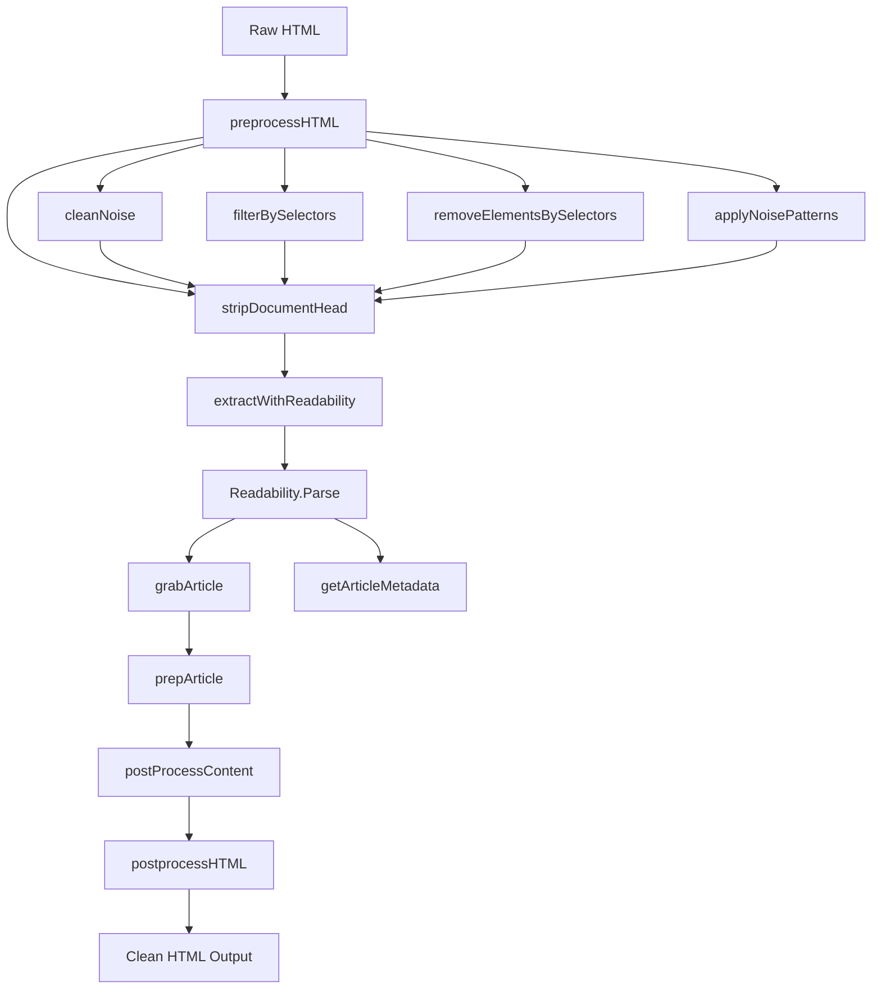

---

## Stage 1: Preprocessing (`preprocessHTML`)

### Purpose
Cleans raw HTML before readability parsing by removing noise, applying selectors, and stripping the `<head>` element.

### Flow

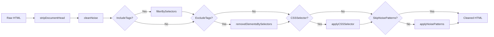

### Methods

#### `stripDocumentHead(html string) string`
- Removes the entire `<head>` element from HTML
- Uses goquery to parse and remove `<head>` nodes
- Returns the remaining body HTML

#### `cleanNoise(html string) string`
Removes noise elements using regex patterns:

| Pattern | Element Removed |
|---------|-----------------|
| `scriptRe` | `<script>...</script>` |
| `styleRe` | `<style>...</style>` |
| `noScriptRe` | `<noscript>...</noscript>` |
| `iframeRe` | `<iframe>...</iframe>` |
| `svgRe` | `<svg>...</svg>` |
| `dataImgRe` | `` |
| `urlTextRe` | URLs in text |
| `buttonRe` | `<button>...</button>` |

#### `filterBySelectors(html string, selectors []string) string`
- Finds elements matching each CSS selector
- Extracts text content from matched elements
- Returns concatenated text or original HTML if no matches

#### `removeElementsBySelectors(html string, selectors []string) string`
- Removes all elements matching any of the provided CSS selectors
- Used to exclude unwanted content (e.g., ads, navigation)

#### `applyCSSSelector(html, selector string) string`
- Applies a single CSS selector to extract specific content
- Returns HTML content of first match or empty string

#### `applyNoisePatterns(html string) string`
Identifies and removes noise wrapper elements by checking:
- Class/ID against `noisePatterns` list (sidebar, nav, footer, etc.)
- Exact token matches (`toc`, `share`, `related`, etc.)
- Prefix matches (`ad-`, `ads-`)
- ARIA roles (`navigation`, `banner`, `contentinfo`, `complementary`)

#### `isNoiseWrapper(attributes, role string) bool`
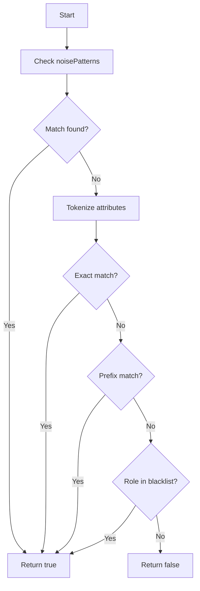

---

## Stage 2: Readability Parsing

### Entry Point: `Parse(input io.Reader, pageURL string) (Article, error)`

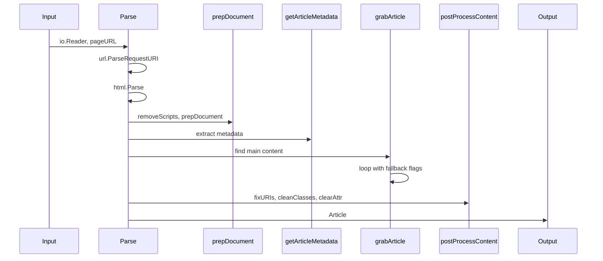

### Main Parse Flow

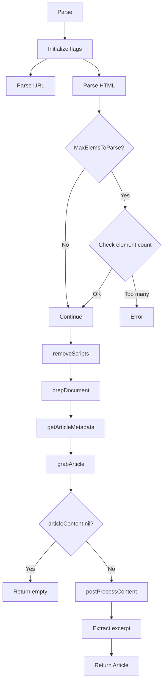

### `grabArticle()` - Core Content Detection

This is the heart of the algorithm. It identifies the main article content through scoring.

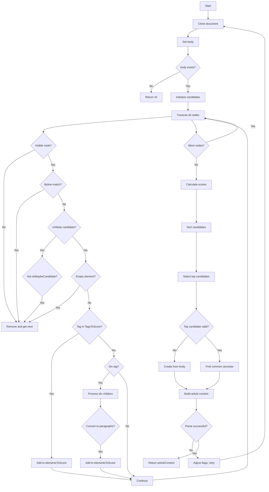

#### Step 1: Node Traversal & Candidate Collection

For each node in document tree:
1. **Visibility Check** (`isProbablyVisible`): Skip hidden elements
2. **Byline Check** (`checkByline`): Extract author info
3. **Unlikely Candidates Filter**: Remove ad-related, sidebar elements
4. **Empty Element Check**: Remove elements with only `<br>` or `<hr>`
5. **Scoring Tags**: Add `<section>`, `<h2-h6>`, `<p>`, `<td>`, `<pre>` to scoring list
6. **Div Processing**: Convert `<div>` children to `<p>` if phrasing content

#### Step 2: Content Scoring

```mermaid
flowchart TD
    A[For each elementToScore] --> B{Parent exists?}
    B -->|No| C[Skip]
    B -->|Yes| D{Inner text >= 25?}
    D -->|No| C
    D -->|Yes| E[Get 3 ancestors]
    E --> F[Calculate base score]
    F --> G[+1 per comma]
    G --> H[+ floor(len/100), max 3]
    H --> I[For each ancestor]
    I --> J{Ancestor has score?}
    J -->|No| K[Initialize with classWeight]
    K --> L[Add to candidates]
    J -->|Yes| M[Divide score by level]
    M --> L
    L --> N{Continue ancestors?}
    N -->|Yes| I
    N -->|No| O[Next element]
    O --> A
```

**Scoring Formula:**
```
baseScore = 1 + commaCount + floor(textLength/100) [capped at 3]
ancestorScore = baseScore / levelDivider
where levelDivider: 0→1, 1→2, 2→6, 3→9, etc.
```

**Initial Node Scores** (`initializeNode`):
- `<div>`: +5
- `<pre>`, `<td>`, `<blockquote>`: +3
- `<address>`, `<ol>`, `<ul>`, `<dl>`, `<dd>`, `<dt>`, `<li>`, `<form>`: -3
- `<h1-h6>`, `<th>`: -5
- Class-based weights (from `getClassWeight`)

#### Step 3: Link Density Adjustment

```mermaid
flowchart LR
    A[Candidate] --> B[getLinkDensity]
    B --> C[linkTextLength / totalTextLength]
    C --> D[newScore = score * (1 - linkDensity)]
```

#### Step 4: Top Candidate Selection

1. Sort candidates by score (descending)
2. Take top N (default 5)
3. If top is `<body>` or nil, create candidate from body children
4. Check for common ancestor among alternatives (if >= 3 candidates have 75% of top score)
5. Walk up to find parent with sufficient score

#### Step 5: Article Content Building

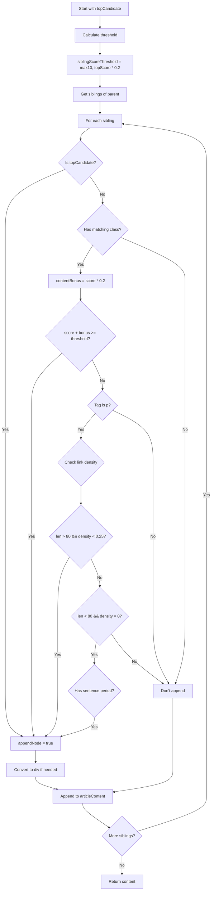

### `prepArticle(articleContent *html.Node)`

Cleans the extracted content:

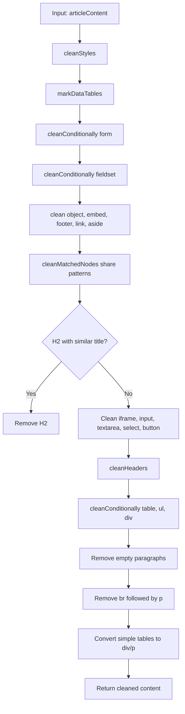

### Metadata Extraction (`getArticleMetadata`)

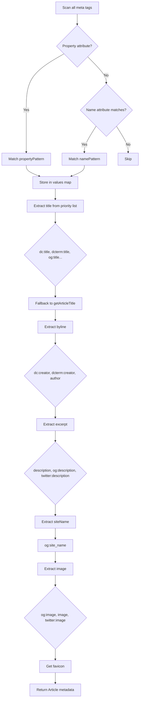

### Article Title Extraction (`getArticleTitle`)

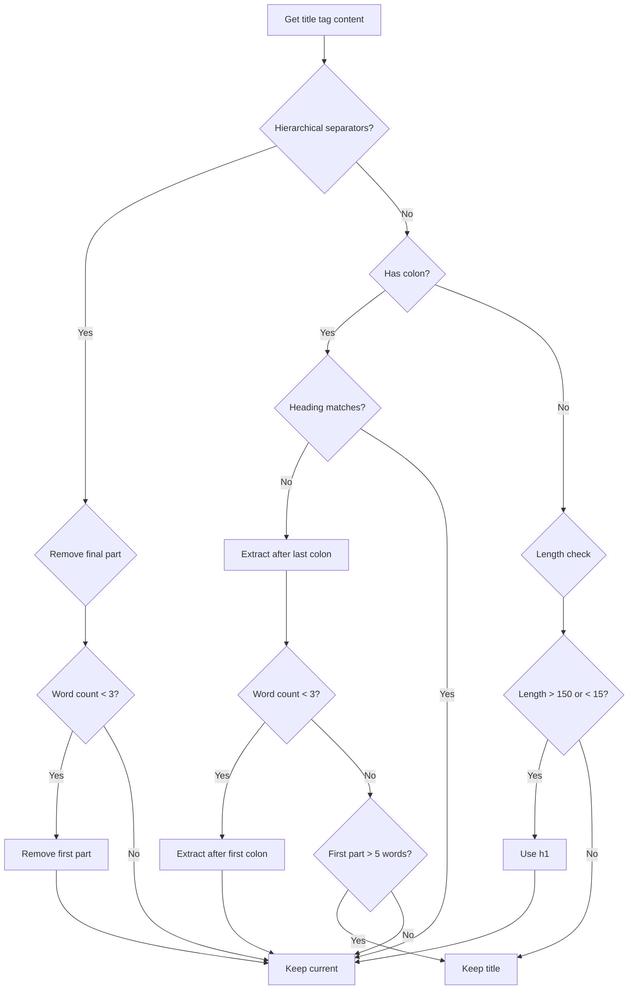

### Fallback Mechanism

If initial parse fails (textLength < 500), the algorithm retries with relaxed flags:

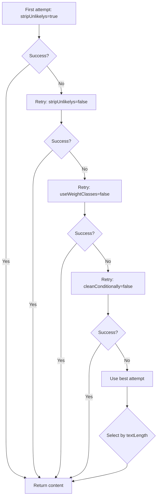

---

## Stage 3: Postprocessing

### `postProcessContent(articleContent *html.Node)`

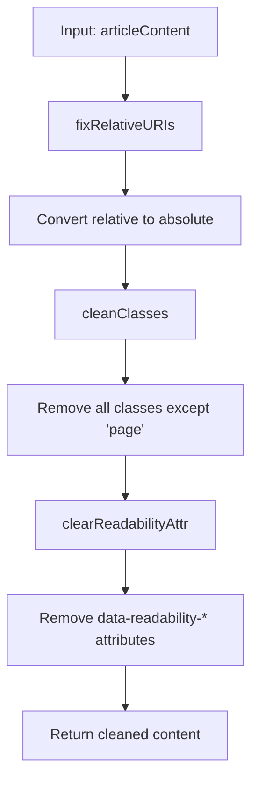

### `postprocessHTML(html string) string`

Final regex-based cleanup:

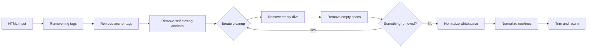

---

## Readability Methods Reference

### DOM Helper Functions

| Method | Purpose |
|--------|---------|
| `firstElementChild(node)` | Get first child element |
| `nextElementSibling(node)` | Get next sibling element |
| `appendChild(node, child)` | Add child (move if exists) |
| `childNodes(node)` | Get all direct children |
| `includeNode(nodeList, node)` | Check if node in list |
| `cloneNode(node)` | Deep clone node |
| `createElement(tagName)` | Create new element |
| `createTextNode(data)` | Create text node |
| `getElementsByTagName(node, tag)` | Find all by tag |
| `getAttribute(node, attr)` | Get attribute value |
| `setAttribute(node, attr, val)` | Set attribute |
| `removeAttribute(node, attr)` | Remove attribute |
| `hasAttribute(node, attr)` | Check attribute exists |
| `outerHTML(node)` | Serialize node and children |
| `innerHTML(node)` | Serialize children only |
| `documentElement(doc)` | Get `<html>` root |
| `className(node)` | Get class attribute |
| `id(node)` | Get id attribute |
| `children(node)` | Get element children only |
| `tagName(node)` | Get tag name |
| `textContent(node)` | Get all text |
| `toAbsoluteURI(uri, base)` | Convert to absolute URL |

### Readability Core Methods

| Method | Purpose |
|--------|---------|
| `Parse(input, pageURL)` | Main entry point |
| `grabArticle()` | Find main content |
| `prepArticle(content)` | Clean extracted content |
| `getArticleMetadata()` | Extract meta tags |
| `getArticleTitle()` | Extract/normalize title |
| `getArticleFavicon()` | Find favicon |
| `prepDocument()` | Initial document prep |

### Scoring & Analysis Methods

| Method | Purpose |
|--------|---------|
| `initializeNode(node)` | Set initial score |
| `getContentScore(node)` | Get score from attribute |
| `setContentScore(node, score)` | Store score in attribute |
| `getClassWeight(node)` | Calculate class-based weight |
| `getLinkDensity(element)` | Calculate link text ratio |
| `getInnerText(node, normalize)` | Get text with optional normalize |
| `getCharCount(node, s)` | Count character occurrences |
| `getNodeAncestors(node, depth)` | Get parent chain |

### Traversal Methods

| Method | Purpose |
|--------|---------|
| `removeAndGetNext(node)` | Remove node, return next |
| `getNextNode(node, ignoreKids)` | Tree traversal |
| `getAllNodesWithTag(node, tags...)` | Find multiple tag types |

### Content Detection Methods

| Method | Purpose |
|--------|---------|
| `isProbablyVisible(node)` | Check visibility |
| `isPhrasingContent(node)` | Check if text-like |
| `isWhitespace(node)` | Check if whitespace |
| `isElementWithoutContent(node)` | Check empty element |
| `hasChildBlockElement(element)` | Check for block children |
| `hasSingleTagInsideElement(elem, tag)` | Check single child |
| `checkByline(node, matchStr)` | Detect byline |
| `isValidByline(byline)` | Validate byline format |

### Cleaning Methods

| Method | Purpose |
|--------|---------|
| `clean(node, tag)` | Remove elements by tag |
| `cleanStyles(node)` | Remove style attributes |
| `cleanConditionally(elem, tag)` | Conditional removal |
| `cleanMatchedNodes(e, filter)` | Pattern-based removal |
| `cleanHeaders(e)` | Remove negative headers |
| `cleanClasses(node)` | Remove unwanted classes |
| `cleanTables(root)` | Mark data tables |
| `removeNodes(list, filter)` | Bulk removal |
| `replaceNodeTags(list, tag)` | Bulk tag change |

### URI & Utility Methods

| Method | Purpose |
|--------|---------|
| `fixRelativeURIs(content)` | Convert relative URLs |
| `removeScripts(doc)` | Remove script elements |
| `removeComments(doc)` | Remove HTML comments |
| `hasAncestorTag(node, tag, depth, filter)` | Check ancestry |
| `getRowAndColumnCount(table)` | Table analysis |
| `isReadabilityDataTable(node)` | Check data table flag |
| `setReadabilityDataTable(node, bool)` | Set data table flag |

### Array/Collection Helpers

| Method | Purpose |
|--------|---------|
| `forEachNode(list, fn)` | Iterate with index |
| `someNode(list, fn)` | Any match? |
| `everyNode(list, fn)` | All match? |
| `concatNodeLists(lists...)` | Concatenate lists |
| `indexOf(array, key)` | Find index |
| `wordCount(str)` | Count words |

---

## IsReadable Quick Check

```mermaid
flowchart TD
    A[Quick scan for p, pre, br] --> B[Build node list]
    B --> C[For each node]
    C --> D{Probably visible?}
    D -->|No| E[Skip]
    D -->|Yes| F{Unlikely candidate?}
    F -->|Yes| E
    F -->|No| G{Parent is li?}
    G -->|Yes| E
    G -->|No| H{Text length >= 140?}
    H -->|Yes| I[score += sqrt(len - 140)]
    I --> J{score > 20?}
    J -->|Yes| K[Return true]
    J -->|No| C
    H -->|No| C
    E --> C
    C --> L{More nodes?}
    L -->|Yes| C
    L -->|No| M[Return false]
```

---

## Constants Reference

### `divToPElems`
Elements that trigger div-to-p conversion: `a`, `blockquote`, `div`, `dl`, `img`, `ol`, `p`, `pre`, `select`, `table`, `ul`

### `alterToDivExceptions`
Tags NOT converted to div when building article: `article`, `div`, `p`, `section`

### `presentationalAttributes`
Removed during style cleaning: `align`, `background`, `bgcolor`, `border`, `cellpadding`, `cellspacing`, `frame`, `hspace`, `rules`, `style`, `valign`, `vspace`

### `deprecatedSizeAttributeElems`
Width/height removed from: `table`, `th`, `td`, `hr`, `pre`

### `phrasingElems`
Inline/text elements for phrasing content check: `abbr`, `audio`, `b`, `bdo`, `br`, `button`, `cite`, `code`, `data`, `datalist`, `dfn`, `em`, `embed`, `i`, `img`, `input`, `kbd`, `label`, `mark`, `math`, `meter`, `noscript`, `object`, `output`, `progress`, `q`, `ruby`, `samp`, `script`, `select`, `small`, `span`, `strong`, `sub`, `sup`, `textarea`, `time`, `var`, `wbr`

---

## Regular Expressions Reference

### Candidate Detection
- `rxUnlikelyCandidates`: `-ad-`, `banner`, `sidebar`, `share`, `social`, `comment`, etc.
- `rxOkMaybeItsACandidate`: `and`, `article`, `body`, `column`, `main`, `shadow`
- `rxPositive`: `article`, `body`, `content`, `entry`, `main`, `page`, `post`, `text`, `blog`
- `rxNegative`: `hidden`, `banner`, `contact`, `footer`, `meta`, `sidebar`, `widget`

### Metadata
- `rxByline`: `byline`, `author`, `dateline`, `writtenby`, `p-author`
- `rxPropertyPattern`: Matches `og:`, `dc:`, `dcterm:`, `twitter:` property names
- `rxNamePattern`: Matches meta name attributes

### Title Processing
- `rxTitleSeparator`: `|`, `-`, `\`, `/`, `»` with spaces
- `rxTitleHierarchySep`: Hierarchy separators
- `rxTitleRemoveFinalPart`: Remove after separator
- `rxTitleRemove1stPart`: Remove before separator
- `rxTitleAnySeparator`: Any separator pattern

### Video Detection
- `rxVideos`: YouTube, Vimeo, DailyMotion, QQ, Twitch, Wikipedia archives

---

## Default Configuration

```go
MaxElemsToParse:   0      // No limit
NTopCandidates:    5      // Keep top 5 candidates
CharThresholds:    500    // Min text length for success
ClassesToPreserve: ["page"]  // Keep page class
TagsToScore:       ["section", "h2", "h3", "h4", "h5", "h6", "p", "td", "pre"]
KeepClasses:       false  // Strip classes
```